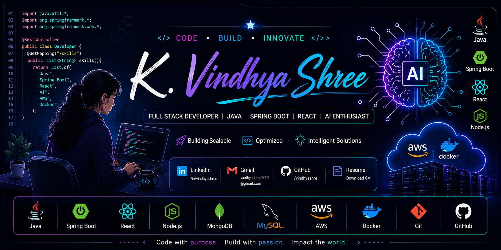

<!-- ========================================================= -->

<!--                     HERO SECTION                          -->

<!-- ========================================================= -->

  

<h1 align="center">

Hi 👋, I'm <strong>K. Vindhya Shree</strong>

</h1>

<h3 align="center">

Java Backend Developer • Spring Boot • React • Full Stack Developer • AI Enthusiast

</h3>

<h5 align="center">

  Building scalable enterprise applications with Java, Spring Boot, React, Cloud, and AI.

</h5>

---

# 🌐 Connect With Me

---

---

# 👩‍💻 About Me

🎓 MCA Graduate passionate about building enterprise-grade software.

💻 Full Stack Developer with experience in **Java, Spring Boot, React, Node.js, MongoDB, and MySQL**.

🤖 Interested in **Artificial Intelligence, Machine Learning, NLP, and Automation**.

☁️ Exploring **AWS Cloud, Docker, Microservices, and DevOps**.

🚀 Passionate about solving real-world business problems through scalable architecture and clean code.

📍 Bengaluru, Karnataka, India

💼 Currently looking for **Software Engineer / Java Developer / Full Stack Developer** opportunities.

---

## 💡 Highlights

---

# 🎯 2026 Goals

- ✅ Secure a Java Backend Developer role

- ✅ Master Spring Security & Microservices

- ✅ Earn an AWS Certification

- ✅ Contribute to Open Source

- ✅ Build production-ready full-stack applications

- ✅ Strengthen Data Structures & Algorithms

---                                                                                                                                                                  <!-- ========================================================= --> 

<!--                      TECH STACK                           -->

<!-- ========================================================= -->

# 🛠️ Tech Stack

## 👨‍💻 Programming Languages

---

## ⚡ Frontend Development

---

## 🚀 Backend Development

---

## 🗄️ Databases

---

## ☁️ Cloud & DevOps

---

## 🧰 Tools & IDEs

---

## 🤖 AI / Machine Learning

---

# 💼 Developer Toolbox

| Category | Technologies |

|-----------|--------------|

| 💻 Languages | Java, JavaScript, Python |

| 🎨 Frontend | React, Redux, HTML5, CSS3, Bootstrap, Vite |

| ⚙️ Backend | Spring Boot, Spring Security, Node.js, Express.js |

| 🗄️ Database | MySQL, MongoDB |

| 🔗 APIs | REST APIs, JWT Authentication |

| ☁️ Cloud | AWS (Fundamentals), Docker |

| 🛠️ Tools | Git, GitHub, Maven, Postman, IntelliJ IDEA, Eclipse, VS Code |

| 🤖 AI | OpenAI, Whisper, NLLB-200, Coqui TTS, TensorFlow |

---

# 🌱 Currently Learning

| Technology | Current Focus |

|------------|---------------|

| 🔐 Spring Security | Authentication & Authorization |

| ☁️ AWS | EC2, S3, IAM |

| 🐳 Docker | Containerization |

| 🏗️ Microservices | Spring Cloud |

| 📐 System Design | Scalable Architectures |

| 🧩 DSA | Java Problem Solving |

---

# 📌 Development Principles

- ✅ Write clean, maintainable, and reusable code.

- ✅ Follow RESTful API design principles.

- ✅ Build responsive and accessible user interfaces.

- ✅ Use Git for effective version control.

- ✅ Focus on performance, scalability, and security.

- ✅ Continuously learn and improve through real-world projects.

---
<!-- ========================================================= -->

<!--               PROFESSIONAL EXPERIENCE                     -->

<!-- ========================================================= -->

# 💼 Professional Experience

<table>

<tr>

<td width="33%" valign="top">

## 🚀 Web Developer Intern

### NavBunnies

📍 Bengaluru, India

**Key Responsibilities**

- Developed responsive web interfaces using React.js.

- Built reusable UI components to improve maintainability.

- Integrated frontend modules with backend REST APIs.

- Improved application responsiveness across desktop and mobile devices.

- Fixed UI bugs and enhanced user experience.

- Collaborated with developers using Git and Agile practices.

**Tech Stack**

`React` `JavaScript` `HTML5` `CSS3`

</td>

<td width="33%" valign="top">

## 🌐 MERN Stack Developer Intern

### Edunet Foundation

📍 Bengaluru, India

**Key Responsibilities**

- Developed full-stack applications using the MERN stack.

- Created REST APIs with Express.js and Node.js.

- Integrated MongoDB for efficient data management.

- Built reusable React components.

- Participated in debugging, testing, and feature implementation.

- Used Git for version control and collaborative development.

**Tech Stack**

`MongoDB` `Express.js` `React` `Node.js`

</td>

<td width="33%" valign="top">

## ☕ Full Stack Developer Intern

### Ripan Technologies

📍 Bengaluru, India

**Key Responsibilities**

- Developed backend services using Spring Boot.

- Implemented CRUD operations with MySQL.

- Tested APIs using Postman.

- Integrated backend APIs with React frontend.

- Fixed backend issues and optimized application logic.

- Worked in Agile sprint planning and code reviews.

**Tech Stack**

`Java` `Spring Boot` `React` `MySQL`

</td>

</tr>

</table>

---

# 🏆 Professional Highlights

| Achievement | Details |

|-------------|---------|

| 💼 Internship Experience | 3 Software Development Internships |

| ☕ Backend Development | Java & Spring Boot |

| 🌐 Full Stack Development | MERN Stack |

| 🤖 AI Applications | Complaint Management & Speech Translator |

| ☁ Cloud Learning | AWS & Docker |

| 📚 Continuous Learning | Microservices & System Design |

---

<!-- ========================================================= -->

<!--                 FEATURED PROJECTS                         -->

<!-- ========================================================= -->

# 🚀 Featured Projects

---

## 🤖 AI Complaint Management System

### 📖 Overview

An AI-powered pharmaceutical complaint management platform that processes complaint emails and PDFs, extracts structured information, and assists quality assurance teams through intelligent AI-based analysis.

### ✨ Key Features

- AI-powered complaint classification

- PDF & email processing

- QA review dashboard

- Smart search & filtering

- Complaint analytics

- Secure role-based workflow

### 🛠️ Tech Stack

`FastAPI` `React` `Redux Toolkit` `SQLite` `Python`

<!-- Add only when deployed -->

<!--

-->

---

## 🌍 AI Speech Translator

### 📖 Overview

A multilingual speech-to-speech translation application that converts spoken language into translated speech using modern AI models.

### ✨ Key Features

- Speech recognition

- 200+ language translation

- Natural voice synthesis

- Emotion-aware speech

- Interactive UI

### 🛠️ Tech Stack

`Python` `Whisper` `NLLB-200` `Coqui TTS` `Streamlit`

---

## 💳 Banking Management System

### 📖 Overview

Enterprise-style banking management system built using Java Spring Boot with authentication, account management, and secure REST APIs.

### ✨ Key Features

- JWT Authentication

- Customer & Admin Roles

- CRUD Operations

- REST APIs

- Swagger Documentation

- MySQL Integration

### 🛠️ Tech Stack

`Java` `Spring Boot` `Spring Security` `Hibernate` `MySQL`

---

## 🛒 ShopSphere

### 📖 Overview

A modern MERN e-commerce platform supporting authentication, shopping cart, product management, and responsive user interfaces.

### ✨ Key Features

- Product catalogue

- Shopping cart

- Authentication

- Order management

- Responsive design

### 🛠️ Tech Stack

`MongoDB` `Express.js` `React` `Node.js`

---

## 🏛️ City of Destiny

### 📖 Overview

A tourism and culture portal showcasing historical locations, attractions, and interactive experiences.

### 🛠️ Tech Stack

`React` `Node.js` `Express.js` `MongoDB`

---

## 🐳 Dockerized Full Stack Application

### 📖 Overview

Containerized full-stack application demonstrating Docker-based development, deployment, and scalable architecture.

### ✨ Key Features

- Docker Compose

- Multi-container setup

- Spring Boot Backend

- React Frontend

- MySQL Database

### 🛠️ Tech Stack

`Docker` `React` `Spring Boot` `MySQL`

---

# 📊 Project Summary

| Category | Count |

|----------|------:|

| 🚀 Total Projects | 10+ |

| ☕ Java Projects | 5+ |

| 🌐 Full Stack Applications | 6+ |

| 🤖 AI Projects | 2 |

| 🔐 Authentication Projects | Multiple |

| ☁ Docker / Cloud Projects | Growing |

---                                                                                                                                                            <!-- ========================================================= --> 

<!--                  GITHUB ANALYTICS                         -->

<!-- ========================================================= -->

# 📊 GitHub Analytics

---

# 🏆 GitHub Trophies

---

# 📈 Contribution Graph

---

# 🚀 Developer Snapshot

| 💡 Category | 📌 Details |

|-------------|------------|

| 👨‍💻 Primary Language | Java |

| 🚀 Backend Framework | Spring Boot |

| ⚛️ Frontend | React |

| 🌐 Full Stack | MERN Stack |

| 🤖 AI | NLP & Intelligent Applications |

| ☁ Cloud | AWS Fundamentals |

| 🐳 DevOps | Docker |

| 💾 Database | MySQL & MongoDB |

---

# 🏅 Achievements

| Achievement | Description |

|------------|-------------|

| 🎓 MCA Graduate | Atria Institute of Technology |

| 💼 Internship Experience | Completed internships in Web, MERN, and Full Stack Development |

| ☕ Java Backend Projects | Developed REST APIs using Spring Boot |

| 🌐 Full Stack Applications | Built responsive MERN applications |

| 🤖 AI Projects | AI Complaint Management & AI Speech Translator |

| 📊 Data Analytics | Completed Deloitte Data Analytics Job Simulation |

| 💻 Software Engineering | Completed Citi Software Development Job Simulation |

| 📚 Continuous Learning | Spring Security, Microservices, AWS, Docker |

---

# 📜 Certifications

| Certification | Platform |

|--------------|----------|

| Deloitte Data Analytics Job Simulation | Forage |

| Citi Software Development Job Simulation | Forage |

| MERN Stack Training | Edunet Foundation |

| AWS Cloud Fundamentals | Self Learning |

| AI & NLP Projects | Personal Learning |

---

# 🌱 Currently Exploring

---

# 📈 Current Focus

- 🚀 Building production-ready Spring Boot applications

- ☁ Learning AWS cloud deployment

- 🐳 Containerizing applications using Docker

- 🔐 Implementing secure authentication with Spring Security

- 🏗 Understanding scalable Microservice Architecture

- 📚 Improving Data Structures & Algorithms

---

# 📌 Open Source Goals

- ⭐ Contribute to Java & Spring Boot repositories

- ⭐ Publish reusable React components

- ⭐ Maintain production-quality GitHub projects

- ⭐ Improve documentation across all repositories

- ⭐ Build a strong developer portfolio

---                                                                                                                                                             <!-- ========================================================= --> 

<!--                     CONTACT SECTION                       -->

<!-- ========================================================= -->

# 📫 Let's Connect

---

# 💼 Open To

| 💻 Role | ✅ Status |

|---------|-----------|

| Java Developer | Open |

| Spring Boot Developer | Open |

| Full Stack Developer | Open |

| Backend Developer | Open |

| Software Engineer | Open |

---

# 🐍 Contribution Snake

---

# 📊 Profile Summary

| Category | Count |

|----------|------:|

| 💼 Internships | 3 |

| 🚀 Projects | 10+ |

| ☕ Java Projects | 5+ |

| 🤖 AI Projects | 2 |

| 🌐 Full Stack Apps | 6+ |

| ☁ Cloud Technologies | AWS + Docker |

| 💾 Databases | MySQL + MongoDB |

---

# 💡 Favorite Quote

### *"Code with Purpose. Build with Impact."* 🚀

---

<h2 align="center">

⭐ Thank You for Visiting My Profile ⭐

</h2>

If you like my work, don't forget to ⭐ my repositories and connect with me.

---

